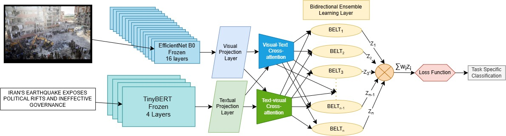

# BELT — Multimodal Bidirectional Ensemble Learning Transformer

**BELT (Multimodal Bidirectional Ensemble Learning Transformer)** is a multimodal deep learning framework for **informativeness classification**, leveraging both textual and visual information.

The project provides a modular implementation of the BELT architecture along with supporting models, training pipelines, evaluation utilities, datasets, and experimental resources.

---

## Architecture

The overall BELT architecture is illustrated below.

<p align="center">
  
</p>

**Figure 1.** Overall architecture of the Multimodal Bidirectional Ensemble Learning Transformer (BELT) for informativeness classification.

---

## Overview

BELT processes multimodal content by jointly utilizing:

* **Textual information**
* **Visual information**
* **Multimodal feature representations**
* **Bidirectional learning**
* **Ensemble-based classification**

The framework is designed as a modular pipeline, allowing individual components such as feature extraction, model architectures, training procedures, and evaluation methods to be independently inspected or modified.

---

## Repository Structure

```text
BELT/
│
├── main.py
├── config.py
├── utils.py
├── pipeline.py
├── requirements.txt
├── README.md
│
├── assets/
│   └── BELT_architecture.png
│
├── data/
│   ├── feature extraction
│   └── dataset implementation
│
├── models/
│   ├── BELT
│   ├── CORAL
│   └── Ensemble
│
└── training/
    ├── training loops
    └── evaluation metrics
```

### Main Components

| File / Directory   | Description                                                |
| ------------------ | ---------------------------------------------------------- |
| `main.py`          | Command-line entry point for running the complete pipeline |
| `config.py`        | Model, training, and experiment configuration              |
| `utils.py`         | Text preprocessing and general utility functions           |
| `pipeline.py`      | High-level orchestration of the BELT workflow              |
| `data/`            | Dataset implementation and feature extraction              |
| `models/`          | BELT, CORAL, and ensemble model architectures              |
| `training/`        | Training loops, validation, and evaluation metrics         |
| `assets/`          | Architecture diagram and other repository figures          |
| `requirements.txt` | Python dependencies                                        |

---

# Setup

## 1. Clone the Repository

```bash
git clone <repository-url>
cd <repository-directory>
```

## 2. Install Dependencies

```bash
pip install -r requirements.txt
```

It is recommended to use a virtual environment or Conda environment before installing the dependencies.

---

# Dataset

The complete dataset is **large in size** and is therefore not included directly in this GitHub repository.

Instead, the dataset and associated experimental resources are provided through Google Drive.

## Dataset & Project Resources

**Google Drive:**

[Google Drive — BELT Dataset & Resources](https://drive.google.com/drive/folders/14829etkP5N7kePzCbHAFkZmZaHt4j3XK?usp=sharing))

The Google Drive provides access to the required dataset as well as additional resources generated during the development and experimentation of the project.

### Google Drive Contents

```text
Google Drive/
│
├── data/
├── data_image/
│
├── augmented/
├── augmented_bagging/
├── augmented_belt/
├── augmented_v2/
│
├── checkpoints/
├── plots/
├── notebooks/
├── Documents/
├── old/
│
└── ...
```

## Required Data

To run the BELT pipeline, the following two directories are required:

### `data/`

Contains the dataset files required for training, development, and testing.

Expected structure:

```text
data/
└── processed/
    ├── inform_train.csv
    ├── inform_dev.csv
    └── inform_test.csv
```

### `data_image/`

Contains the corresponding image data required by the multimodal pipeline.

The directory structure inside `data_image/` should be preserved when downloading the data.

---

## Additional Resources

The Google Drive also provides access to additional project resources.

| Directory            | Description                                   |
| -------------------- | --------------------------------------------- |
| `augmented/`         | Augmented datasets and experiments            |
| `augmented_bagging/` | Bagging-based augmentation experiments        |
| `augmented_belt/`    | BELT-specific augmentation resources          |
| `augmented_v2/`      | Additional augmented-data experiments         |
| `checkpoints/`       | Saved model checkpoints                       |
| `plots/`             | Generated plots and experiment visualizations |
| `notebooks/`         | Jupyter notebooks used during development     |
| `Documents/`         | Supporting project documents                  |
| `old/`               | Previous experiments and results              |

These resources are **optional** for running the main pipeline.

They are provided for users who wish to inspect the experimental development, intermediate results, checkpoints, notebooks, or previous experiments.

---

# Data Directory Setup

After downloading the required folders from Google Drive, the local directory should contain:

```text
data_dir/
│
├── data/
│   └── processed/
│       ├── inform_train.csv
│       ├── inform_dev.csv
│       └── inform_test.csv
│
└── data_image/
    └── ...
```

Make sure that the paths referenced by the CSV files correspond to the location of the downloaded image data.

> **Important:** Preserve the directory and file structure when downloading or moving the dataset. Incorrect image paths may result in dataset loading errors.

---

# Running BELT

The complete BELT pipeline can be executed from the command line using `main.py`.

```bash
python main.py --data-dir "C:/path/to/data" --base "C:/path/to/data_image"
```

For example:

```bash
python main.py --data-dir "C:/BELT/data" --base "C:/BELT/data_image"
```

Replace the paths with the corresponding locations on your system.

---

# Models

The `models/` directory contains the principal model implementations used in the project.

### BELT

The primary multimodal architecture proposed in this project.

### CORAL

An additional classification architecture used within the experimental framework.

### Ensemble

Ensemble-based components used to combine model outputs within the classification framework.

Model configurations and hyperparameters can be modified through `config.py`.

---

# Configuration

Model and training parameters are centralized in:

```text
config.py
```

This file contains configuration options such as:

* Model dimensions
* Learning rate
* Batch size
* Number of epochs
* Optimization settings
* Feature dimensions
* Training configuration
* Experiment-specific parameters

Review `config.py` before running new experiments or modifying the default configuration.

---

# Training and Evaluation

The `training/` directory contains the components responsible for:

* Model training
* Validation
* Testing
* Loss calculation
* Evaluation metrics
* Experiment evaluation

The implementation is modular so that individual training or evaluation components can be modified independently.

---

# Experimental Resources

The Google Drive contains additional resources generated throughout the development of BELT.

These include:

```text
notebooks/
    └── Development and experiment notebooks

checkpoints/
    └── Saved model checkpoints

plots/
    └── Evaluation plots and visualizations

old/
    └── Previous experiments and results
```

These resources are provided for **reference, analysis, and reproducibility**.

They are not required for a standard execution of the main pipeline.

---

# Quick Start

For users who only want to run the BELT pipeline:

### 1. Clone the repository

```bash
git clone <repository-url>
cd <repository-directory>
```

### 2. Install dependencies

```bash
pip install -r requirements.txt
```

### 3. Access the dataset

Open the project Google Drive:

[Google Drive — BELT Dataset & Resources]((https://drive.google.com/drive/folders/14829etkP5N7kePzCbHAFkZmZaHt4j3XK?usp=sharing))

### 4. Download the required directories

Download:

```text
data/
data_image/
```

You do **not** need to download the other folders unless you want to inspect the experiments, results, checkpoints, or notebooks.

### 5. Verify the directory structure

```text
data_dir/
├── data/
│   └── processed/
│       ├── inform_train.csv
│       ├── inform_dev.csv
│       └── inform_test.csv
│
└── data_image/
    └── ...
```

### 6. Run the pipeline

```bash
python main.py --data-dir "C:/path/to/data" --base "C:/path/to/data_image"
```

---

# Reproducibility

For reproducing the experiments:

1. Use the source code provided in this repository.
2. Download the required dataset from the Google Drive.
3. Preserve the original dataset directory structure.
4. Install the dependencies specified in `requirements.txt`.
5. Use the configuration provided in `config.py`.
6. Run the appropriate pipeline or notebook.
7. Refer to the available checkpoints, plots, notebooks, and previous experimental results in the Google Drive when required.

The dataset and experimental resources are maintained separately from the source-code repository because of their large size.

---

# Resource Availability

| Resource             | GitHub Repository | Google Drive |
| -------------------- | :---------------: | :----------: |
| Source code          |         ✓         |       —      |
| Architecture diagram |         ✓         |       —      |
| Dataset              |         —         |       ✓      |
| Image data           |         —         |       ✓      |
| Augmented datasets   |         —         |       ✓      |
| Model checkpoints    |         —         |       ✓      |
| Experiment plots     |         —         |       ✓      |
| Jupyter notebooks    |         —         |       ✓      |
| Previous results     |         —         |       ✓      |
| Supporting documents |         —         |       ✓      |

---

# Notes

* The dataset is **not included in the GitHub repository** because of its large size.
* The Google Drive provides access to the required dataset and additional experimental resources.
* Only `data/` and `data_image/` are required for the standard BELT pipeline.
* The remaining folders are optional and can be explored for experimental analysis and reproducibility.
* Preserve the original directory structure when downloading the dataset.
* Ensure that image paths remain consistent with the paths expected by the dataset files.
* Check `config.py` before running experiments with modified settings.

---

# Citation

If you use the BELT framework, dataset, or associated experimental resources in your research, please cite the corresponding work:

```bibtex
@article{
    ...
}
```

> Replace the placeholder above with the final citation information once the corresponding publication details are available.

---

# Contact

For questions regarding the implementation, dataset, experiments, or reproducibility, please use the issue tracker of this repository or contact the project authors.
